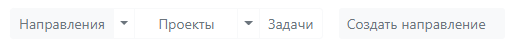

# Переключение представлений

Основываясь на структурных элементах, приложение имеет соответствующие представления. По умолчанию, при первом запуске, отображаются Направления. При этом кнопка, отвечающая за Направления, будет активна (окрашена в серый цвет).

