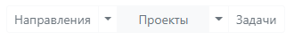
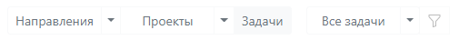

# Переключение представлений

Основываясь на структурных элементах, приложение имеет соответствующие представления. По умолчанию, при первом запуске, отображаются Направления. При этом кнопка, отвечающая за Направления, будет активна (окрашена в серый цвет)

  
\
Для отображения Проектов, достаточно кликнуть на кнопку Проекты. После чего, она также станет активна

\
При отображении Задач, становится доступна работа Фильтра

